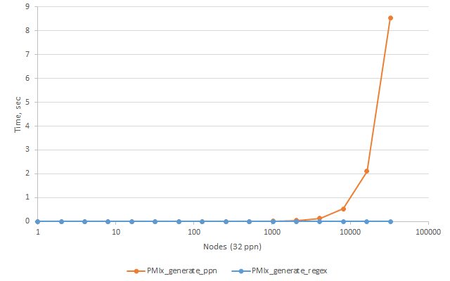

### Implementation descriptions

This benchmark simulates processes mapping and shows a time spent at `PMIx_generate_regex` and `PMIx_generate_ppn` for this mapping. As result, those API generates `PMIX_NODE_MAP` and `PMIX_PROC_MAP` accordingly.

### Output example:
```
$./pmix_regexp_test
nnodes     procs      pmix.nmap  pmix.pmap
-----------------------------------------
1          32         0.000033   0.000036
2          64         0.000031   0.000043
...
32768      1048576    0.004556   8.537842
```

### Performance evaluation:




